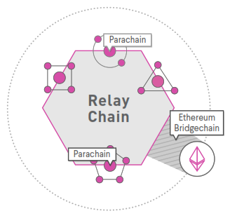
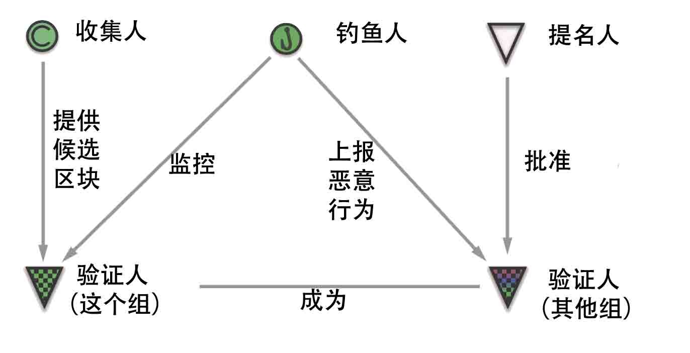
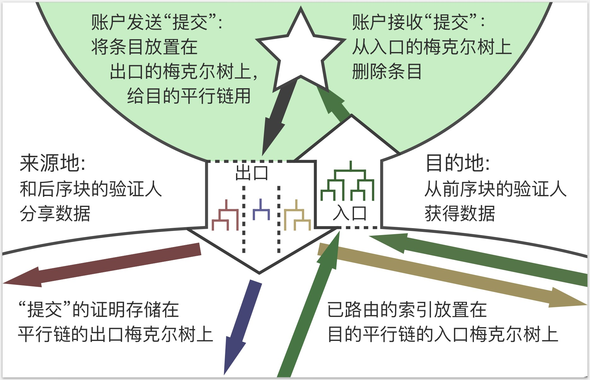
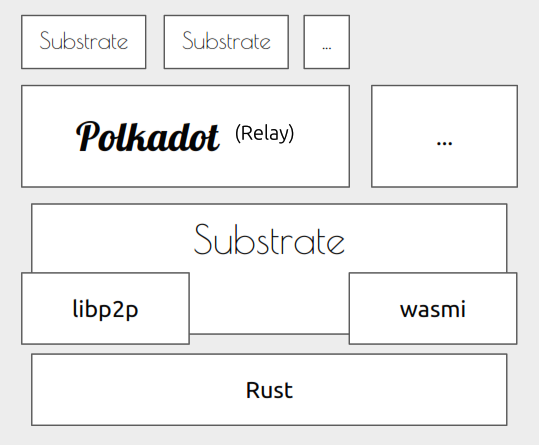
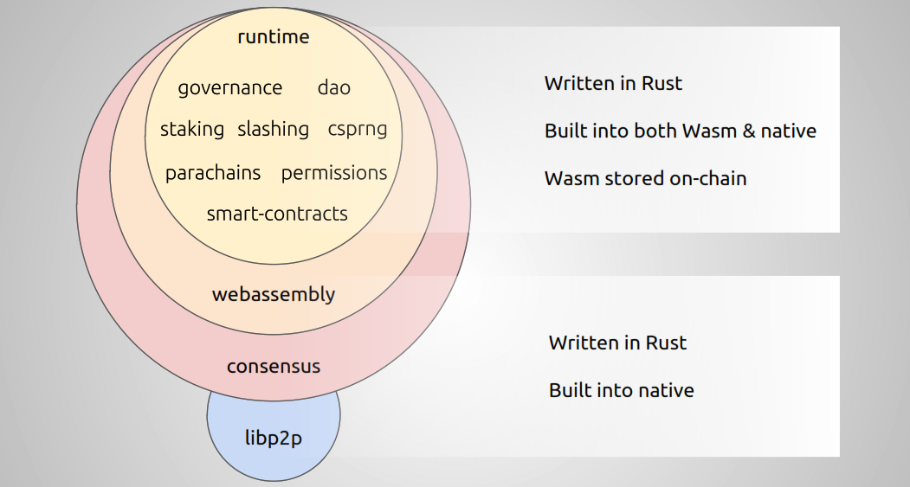
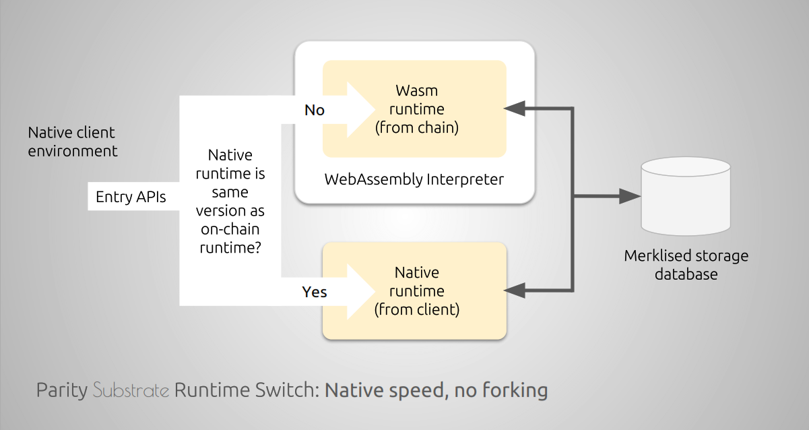

# Substrate & Polkadot

## Polkadot诞生背景

polkadot认为如今的区块链技术栈中存在五个关键技术点，而这些技术点目前没有被全面的做到很好。分别是:

1. **伸缩性**

现有的区块链技术无法满足现实生活中所需的大量交易量。即TPS不够。

2. **治理性**

现有的区块链治理侧重于POW与POS，错误地奖励少数人，而牺牲了许多人。

3. **隔离性**

区块链与区块链之间独立，无法进行交互。

4. **可开发性**

正是因为缺少了可扩展性与隔离性，这种分散的理念阻碍了Dapp的发展。

5. **可应用性**

由于缺少以上特性，综合导致了现在的区块链技术不是已被大规模应用的技术，区块链还没有弥合从核心技术到实际应用的差距。

## Polkadot是什么

Polkadot是连接不同链的区块链网络。

Polkadot能够在满足异构链可以交互的情况下，又保障他们的安全性。

代币名为DOT。

## Polkadot特性

- **可交互性**
- **可扩展性**
- **共享安全**

## 多链结构

- **Relay Chain**

中继链，协调parachain之间的共识与交易转发。

- **Parachains**

平行链，真正处理交易的链，可以是各种实现不同业务逻辑的链。

- **Bridges**

转接桥，连接现有区块链，如以太坊，比特币等，它们有自己的共识算法。

## Polkadot网络中的角色

- **验证者(Validators)**

质押DOTs并且真正参与共识的人。可分为基础验证人和可用验证人。

- **提名人(Nominators)**

质押DOTs并提名验证者的人。

- **收集人(Collators)**

收集parachain交易的人，并提供候选区块。

- **钓鱼人(Fisherman)**

监控网络并上报恶意行为。

## 设计综述

## 跨链通信

## Substrate是什么

Substrate是一套用Rust语言实现的区块链框架，它是Polkadot的底层框架。substrate框架将区块链系统进行了模块化的拆分，形成了用于共识、网络和其他配置的模块化组件，此外substrate底层实现了一套通用的状态转换过程(STF)，STF主要实现于SRML模块，SRML模块为区块链开发实现了绝大部分的底层结构，你只要按照它的标准进行开发，你可以快速开发出一条只专注于业务的区块链，而无需去考虑底层的实现。

## 架构图

## Substrate设计

### Executor

Substrate将运行环境分为了Wasm和Native。所谓的Native就是执行本地Rust代码，而所谓Wasm就是执行编译好的Wasm文件。这样的好处在于如果更新区块链代码，无需重启节点就可以进行实时更新，避免分叉问题。

### Extrinsic

在Substrate中Extrinsic就是数据片段，主要有两种类型:交易和固有数据。

#### Transactions

交易通常指的是被一方或多方签名过的数据或行为，这些行为可能造成状态转换或资金流动，并且他们能够被预执行并进行广播，而不会是垃圾信息。

#### Inherent Extrinsics (aka Inherents)

固有数据。一般来说，固有者没有签名，也没有任何其他内在价值的加密指示。因此，他们不像交易那样得到广播。 （从技术上来说，没有任何东西可以阻止substrate广播，但是没有基于费用的垃圾信息预防机制。）相反，它们代表的数据以自以为是的方式描述了许多有效信息之一。除此之外，它们被认为是“真实的”仅仅是因为足够多的验证者已经同意它们是合理的。

举一个例子，有固有的时间戳，它设置块的当前时间戳。这不是Substrate的固定部分，但确实是SRML的一部分
 根据需要使用。没有签名可以从根本上证明一个块在给定时间以与签名可以“证明”转移某些特定资金的愿望完全相同的方式生成。相反，每个验证器的业务是确保他们在同意块候选有效之前将时间戳设置为合理的值。

另一个例子是SRML中用于确定和惩罚或停用离线验证器的“注释错过的提议”。同样，这仅仅是验证者意见的声明，并且由链的运行时逻辑决定对“意见”采取什么行动。

## 使用方式

有三种方式可以使用substrate:

1. **直接使用substrate原生链**

通过运行预先设计好的substrate节点并且配置创世块的初始化信息，从而快速运行一条区块链。这种方式最为便捷，但是提供了最少量的可定制性，主要允许个人更改各种运行时模块的创建参数，例如balances，staking，block-period，fees和governance。

1. **重构SRML模块**

Polkadot RelayChain的使用方式。通过重构原生SRML模块或新增自定义SRML模块，并且可能会重写substrate客户端的区块生成逻辑。这给了开发者极大的自由度，可以根据情况自行选择是否需要更改区块生成逻辑。

1. **通用方式**

开发自由度最高的方式，等于使用substrate现有模块进行重构，生成属于自己的区块链。可以忽略SRML模块，自己定制Runtime模块。如果逻辑的复杂度不影响区块生成的逻辑，那可以直接用wasm blob构建一个新的Genesis块，并且可以直接使用现有的基于Rust的substrate客户端启动区块链。如果逻辑过于复杂已经与现有区块生成逻辑不兼容，那就要对块生成逻辑进行更改，甚至可能改变区块头以及区块序列化的方式。

