# 基于Substrate+Docker开发cryptokitties

> 想知道substrate的基础相关以及如何部署substrate环境，请参考之前的文章：
>
> - **[Substrate环境部署--基于Docker](substrate环境部署.md)**

## 基础知识

- **区块链基础知识**
- **Substrate**

> 版本为substrate 0.11.0-0ee04a85-x86_64-linux-gnu

- **Rust**

> 版本为rustc 1.33.0 (2aa4c46cf 2019-02-28)

- **Docker**

> 版本为  Version:          18.09.2

## 开发环境

- **Centos7**

## 项目设计

> 下面开始才算正式进入我们的开发环节了。我们开发任何一个项目之前都需要先进行设计，完善的设计是项目开发中最重要的，真正的开发不过是对逻辑的一种实现（搬砖）。更何况这是基于区块链的开发，我们更需要去合理的考虑我们的功能以及链上的存储数据。

- 功能设计

> 简单来说就是我们想开发一款应用，这款应用的功能就是养猫，而且每一只猫都是唯一的不可替代的。那我们一共需要哪些功能呢？
>
> - 用户可以领养猫(创建)(唯一 **ERC721**)
> - 用户可以给猫定价(买卖)
> - 买猫
> - 猫与猫生小猫

- 数据结构设计

> 当我们清楚功能之后，我们就需要进行数据结构的设计，那么哪些数据是需要存储在链上，以及以何种形式存储在链上呢？
>
> - Kitty类的设计
> - 所有的猫相关数据结构设计
> - 用户的猫相关数据结构设计

## 项目开发

### 基于案例项目开发，下载案例项目

```shell
$ substrate-node-new <node-name> <author>
我们可以这样使用
$ substrate-node-new substratekitties sher
```

> 接下来我们来详细看看这个脚本里面主要做了什么事情,[substrate-node-new](<https://github.com/paritytech/substrate-up/blob/master/substrate-node-new>)

```shell
#下载案例项目
curl http://releases.parity.io/substrate/x86_64-ubuntu:xenial/latest/substrate-node-template.tar.gz | tar xz 
#将项目换成自己的定好的名字
mv substrate-node-template $dirname 
#项目内部所有名字的替换的方法
function replace {...} 
#进行名字替换
replace "Template Node" "${name}"
replace template-node "${lname//[_ ]/-}"
replace template_node "${lname//[- ]/_}"
replace Anonymous "$author"
#生成wasm相关文件
./build.sh
#本地编译
cargo build --release
```

### 交互测试

```shell
$ cd substratekitties
$ ./target/release/substratekitties --dev
```

> 小知识，如果之前链已经启动过但不想要历史数据，可以先这样操作，再重新启动即可
>
> ```shell
> $ ./target/release/substratekitties purge-chain --dev
> ```

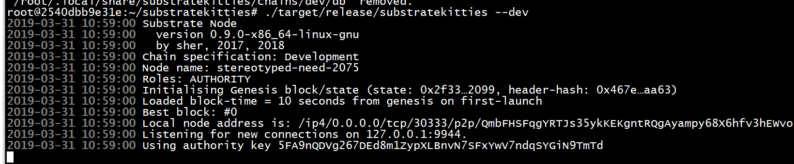

> 如果看到这样代表已经启动成功并且在出块了。

> 然后我们需要通过官方给的连接入口进行连接测试。[substrate-ui](https://substrate-ui.parity.io/)
>
> 进入settings界面，选择Local  Node然后点击保存，当你看到如下界面时候就是连接成功了。

**如果想知道如何连接上部署在远程服务器上的substrate可以看我的另一篇文章**

- **[substrate远程连接](<http://www.sher.vip/article/22>)**

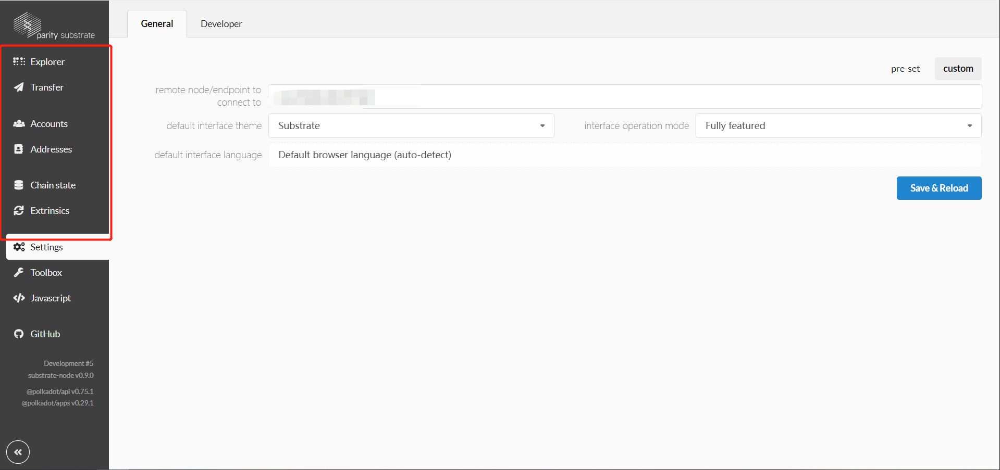

> 接下来我们来进行简单的测试，进行一笔转账，dev开发链给Alice这个账户默认有很多的余额，所以我们可以拿来测试

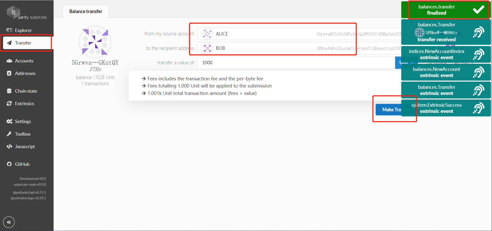

> 简单讲解一下界面上每个操作是用来干嘛的

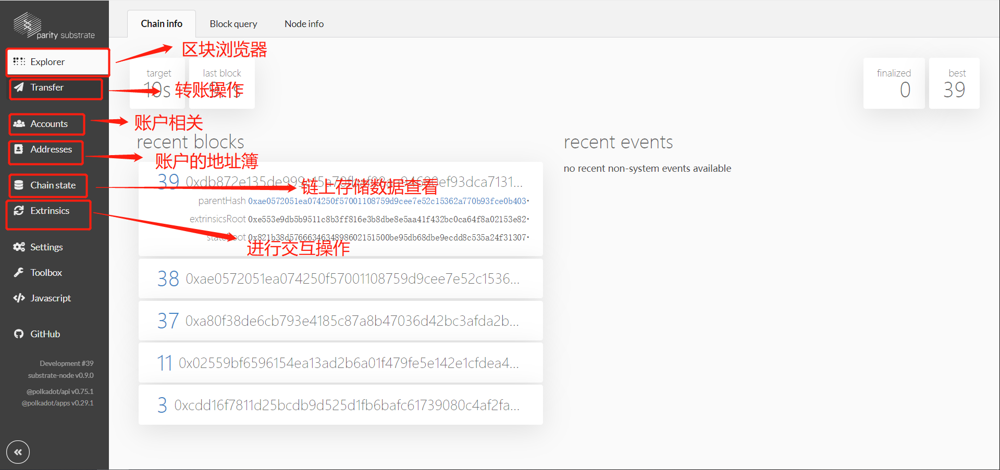

### 如何开发自己的业务

> 现在我们已经看到案例项目的交互已经成功了，那我们该如何开发自己的业务上链。其实官方例子里面已经给了介绍了，该如何进行开发，首先我们要知道我们肯定是对runtime模块进行更改，即在runtime的时候加载我们自己的业务模块。我们可以看一下runtime目录下的template.rs和lib.rs

```shell
root@2540dbb9e31e:~/substratekitties/runtime/src# tree .
.
|-- lib.rs
|-- template.rs
```

> template.rs就是官方给的开发的例子，然后我们可以在lib.rs中看到这样几行

```rust
///引入template模块
mod template;

///使用template模块
impl template::Trait for Runtime {
	type Event = Event;
}
//构造在运行时
construct_runtime!(
....
	//运行时调用模块定义的方法
	TemplateModule: template::{Module, Call, Storage, Event<T>},
....
)
```

> 我们再看template.rs

```rust
///使用的依赖
use support::{decl_module, decl_storage, decl_event, StorageValue, dispatch::Result};
use system::ensure_signed;

///首先需要继承一个Trait
pub trait Trait: system::Trait {
	// TODO： 增加你需要的参数配置
	///引入自定义事件模块
	type Event: From<Event<Self>> + Into<<Self as system::Trait>::Event>;
}

///存储模块
decl_storage! {
	trait Store for Module<T: Trait> as TemplateModule {
        // 这里我们申明了一个存储类型 Something，类型是Option<32>
        // 这里的get(something)是默认的get方法，返回的是存储的值或者空（如果未使用）
		Something get(something): Option<u32>;
	}
}

///业务开发模块
decl_module! {
	///模块定义
	pub struct Module<T: Trait> for enum Call where origin: T::Origin {
		// 初始化自定义的事件，如果自己定义了事件需要在这里进行申明
		fn deposit_event<T>() = default;

		// 业务函数的实现
		pub fn do_something(origin, something: u32) -> Result {
            // 验证执行这个函数的人是否已经是被签名(认可的)
			let who = ensure_signed(origin)?;

			// 改变Something存储的值
			<Something<T>>::put(something);

			// 使用事件
			Self::deposit_event(RawEvent::SomethingStored(something, who));
            //通用返回
			Ok(())
		}
	}
}

///事件定义
decl_event!(
	pub enum Event<T> where AccountId = <T as system::Trait>::AccountId {
		//自定义事件
		SomethingStored(u32, AccountId),
	}
);
```

> 好了，现在我们很清晰的看到该如何进行我们个性化业务的开发了，我们可以照着抄一个模板。

### 新建模块

> 我们需要在runtime/src目录下新建一个我们自己的模块substratekitties.rs

```shell
$ touch substratekitties.rs
```

> 现在的目录结构

```shell
root@2540dbb9e31e:~/substratekitties/runtime/src# tree ~/substratekitties/runtime/src/
/root/substratekitties/runtime/src/
|-- lib.rs
|-- substratekitties.rs
`-- template.rs
```

### 初始化substratekitties.rs

```rust
use support::{decl_storage, decl_module};

//Trait引入
pub trait Trait: system::Trait {}

//存储模块
decl_storage! {
    trait Store for Module<T: Trait> as KittyStorage {
        // Declare storage and getter functions here
    }
}

//业务模块
decl_module! {
    pub struct Module<T: Trait> for enum Call where origin: T::Origin {
        // Declare public functions here
    }
}
```


### 修改lib.rs

```rust
///引入template模块
mod template;
//引入substratekitties模块
mod substratekitties.

///使用template模块
impl template::Trait for Runtime {
	type Event = Event;
}
//使用substratekitties模块
impl substratekitties::Trait for Runtime {
}

//构造在运行时
construct_runtime!(
....
	//运行时调用模块定义的方法
	TemplateModule: template::{Module, Call, Storage, Event<T>},
    //运行时引入substratekitties模块方法
    Substratekitties: substratekitties::{Module, Call, Storage},
....
)
```

### 存储结构定义substratekitties.rs

> 由于我们考虑到我们的业务中一共需要用到3中substrate的特殊类型：
>
> - AccountId
> - Balance
> - Hash
>
> 而这三种类型在system的Trait不存在，我们需要引入一个特定的Trait
>
> 所以需要首先修改substratekitties.rs中的trait模块
>
> ```rust
> pub trait Trait: balances::Trait {
> }
> ```

> 目前所有的依赖模块

```rust
//所有的依赖模块
use support::{decl_storage, decl_module, StorageMap, dispatch::Result};
use system::ensure_signed;
use runtime_primitives::traits::{As, Hash};
use parity_codec::{Encode, Decode};
```

> 然后我们思考该以什么样的形式存储数据？

```rust
//我们既然是针对猫的业务，那我们需要定义一个猫的数据结构
#[derive(Encode, Decode, Default, Clone, PartialEq)]
#[cfg_attr(feature = "std", derive(Debug))]
pub struct Kitty<Hash, Balance> {
    id: Hash,//业务上的唯一id
    dna: Hash,//猫本身的唯一id
    price: Balance,//猫的价格
    gen: u64,//已经是第几代
}
```

> 开始定义存储模块

```rust
//定义需要存储于链上的数据
decl_storage! {
    //我们定义一个存储结构叫KittyStorage
    trait Store for Module<T: Trait> as KittyStorage {
        //用户拥有的猫，map结构，用户地址 => 猫
        OwnedKitty: map T::AccountId => Kitty<T::Hash, T::Balance>;
    }
}
```

> 开始写第一个方法，即用户如何才能开始拥有猫，也就是我们最开始的入口业务，创建一只猫

```rust
//业务开发模块
decl_module! {
    pub struct Module<T: Trait> for enum Call where origin: T::Origin {
		//业务方法，创建猫
        fn create_kitty(origin) -> Result {
            //调用者确认
            let sender = ensure_signed(origin)?;
			
            //新建一只猫
            let new_kitty = Kitty {
                id: <T as system::Trait>::Hashing::hash_of(&0),
                dna: <T as system::Trait>::Hashing::hash_of(&0),
                price: <T::Balance as As<u64>>::sa(0),
                gen: 0,
            };
			
            //插入数据
            <OwnedKitty<T>>::insert(&sender, new_kitty);

            Ok(())
        }
    }
}
```

### 测试

> 由于我们修改了模块，需要对项目进行重新编译，耗时较长

```shell
$ ./build.sh
$ cargo build --release
```

> 然后我们可以开始进行测试

```shell
$ ./target/release/substratekitties --dev
```

> 首先要将结构体引入Developer，进入Settings的Developer，加入以下代码并保存

```shell
{
  "Kitty": {
    "id": "H256",
    "dna": "H256",
    "price": "Balance",
    "gen": "u64"
  }
}
```

> 进入**Extrinsics** 模块

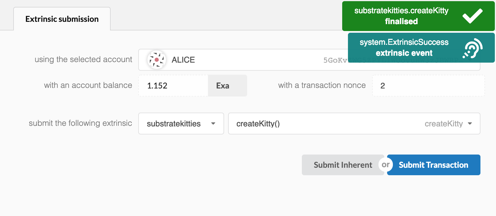

> 进入**Chain state**模块

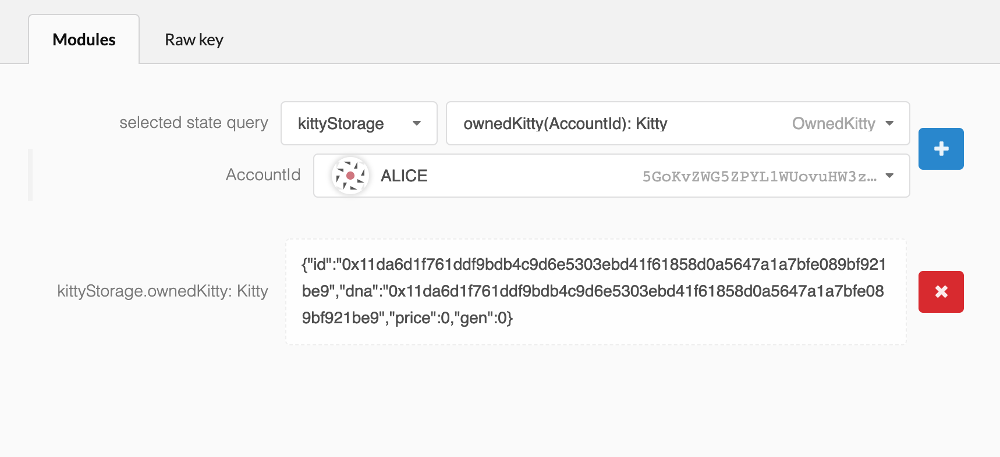

### 继续修改substratekitties.rs

> 至此为止，我们已经知道该如何进行个性化的业务开发的整体流程了，那接下来我们就要进入正式的完善我们的业务的时候了。我们需要重新回到我们最初的设计上的思考，重新构造存储模块，然后还要加入事件模块，然后完善所有的业务功能。

> 重构存储模块

```rust
decl_storage! {
    trait Store for Module<T: Trait> as KittyStorage {
        //所有的猫，map结构， 业务上猫的id => 猫
        Kitties get(kitty): map T::Hash => Kitty<T::Hash, T::Balance>;
        //猫的所有者是谁 map结构 业务上猫的id => 区块链账户地址
        KittyOwner get(owner_of): map T::Hash => Option<T::AccountId>;

        //所有的猫 map结构来替代数组， 下标 => 业务上猫的id
        AllKittiesArray get(kitty_by_index): map u64 => T::Hash;
        //所有的猫的总数
        AllKittiesCount get(all_kitties_count): u64;
        //获得当前猫是第几只猫 业务上猫的id => 猫的总数的位置（下标）
        AllKittiesIndex: map T::Hash => u64;

        //用户拥有的猫 map结构来代替数组, (账户地址,下标) => 业务上猫的id
        OwnedKittiesArray get(kitty_of_owner_by_index): map (T::AccountId, u64) => T::Hash;
        //用户拥有的猫的总数 map结构, 账户地址 => 总数
        OwnedKittiesCount get(owned_kitty_count): map T::AccountId => u64;
        //用户的这只猫是用户的第几只猫 业务上猫的id => index
        OwnedKittiesIndex: map T::Hash => u64;

        //随机数
        Nonce: u64;
    }
}
```

> 功能考虑
>
> - 创建一只猫：create_kitty()
> - 给猫定价：set_price()
> - 转让猫的所有权：transfer()
> - 买猫：buy_kitty()
> - 生小猫：breed_kitty()

> 我们先引入事件模块

```rust
pub trait Trait: balances::Trait {
    type Event: From<Event<Self>> + Into<<Self as system::Trait>::Event>;
}

decl_event!(
    pub enum Event<T>
    where
        <T as system::Trait>::AccountId,
        <T as system::Trait>::Hash,
        <T as balances::Trait>::Balance
    {
        Created(AccountId, Hash),//创建猫事件
        PriceSet(AccountId, Hash, Balance),//定价事件
        Transferred(AccountId, AccountId, Hash),//转让事件
        Bought(AccountId, AccountId, Hash, Balance),//购买事件
    }
);
```

```rust
decl_module! {
    pub struct Module<T: Trait> for enum Call where origin: T::Origin {
		//引入事件模块
        fn deposit_event<T>() = default;
        .....
    }
}
```

> 接下来开始具体功能的实现

```rust
/**
目标：新建一只猫
过程：
1.验证调用用户
2.随机生成id和dna的hash值
3.新建一只猫
4.验证并修改链上数据
	4.1.确保猫的唯一性
	4.2.修改用户相关的基本信息
	4.3.修改总体相关的基本信息
*/
fn create_kitty(origin) -> Result {
    //验证调用用户
	let sender = ensure_signed(origin)?;
    
    //随机hash生成
	let nonce = <Nonce<T>>::get();
	let random_hash = (<system::Module<T>>::random_seed(), &sender, nonce)
	    .using_encoded(<T as system::Trait>::Hashing::hash);

    //新建一只猫
	let new_kitty = Kitty {
	    id: random_hash,
	    dna: random_hash,
	    price: <T::Balance as As<u64>>::sa(0),
	    gen: 0,
	};

    //数据验证与上链
	Self::mint(sender, random_hash, new_kitty)?;

    //修改随机数
	<Nonce<T>>::mutate(|n| *n += 1);

	Ok(())
}
```

> 我们考虑到，当新建一只猫的时候，我们首先要去判断它的唯一性，然后还要去修改多个链上的存储的值，如果全部写在一个方法内会显得非常冗余，我们要精简业务逻辑，所以将复杂的处理单独拿出来做解耦操作。

```rust
///单独定义一个内部模块的实现
impl<T: Trait> Module<T> {
    
    //新建一只猫的过程的验证与修改
    fn mint(to: T::AccountId, kitty_id: T::Hash, new_kitty: Kitty<T::Hash, T::Balance>) -> Result {
        //确保猫的唯一性
        ensure!(!<KittyOwner<T>>::exists(kitty_id), "Kitty already exists");
		
        //修改用户拥有的猫与猫的数量
        let owned_kitty_count = Self::owned_kitty_count(&to);
        let new_owned_kitty_count = owned_kitty_count.checked_add(1)
            .ok_or("Overflow adding a new kitty to account balance")?;
        <KittyOwner<T>>::insert(kitty_id, &to);

        //修改所有的猫与猫的数量
        let all_kitties_count = Self::all_kitties_count();
        let new_all_kitties_count = all_kitties_count.checked_add(1)
            .ok_or("Overflow adding a new kitty to total supply")?;
        <Kitties<T>>::insert(kitty_id, new_kitty);
        
        //修改总量相关的基本信息
        <AllKittiesArray<T>>::insert(all_kitties_count, kitty_id);
        <AllKittiesCount<T>>::put(new_all_kitties_count);
        <AllKittiesIndex<T>>::insert(kitty_id, all_kitties_count);

        //修改用户相关的基本信息
        <OwnedKittiesArray<T>>::insert((to.clone(), owned_kitty_count), kitty_id);
        <OwnedKittiesCount<T>>::insert(&to, new_owned_kitty_count);
        <OwnedKittiesIndex<T>>::insert(kitty_id, owned_kitty_count);

        //申明发生事件
        Self::deposit_event(RawEvent::Created(to, kitty_id));

        Ok(())
    }
}
```

```rust
/**
目标：定价
过程：
1.验证调用者
2.验证需要定价的猫是否存在以及这只猫是否是用户的
3.修改链上数据--猫的价格
4.申明事件
*/
fn set_price(origin, kitty_id: T::Hash, new_price: T::Balance) -> Result {
    //验证调用者
    let sender = ensure_signed(origin)?;
	//验证需要定价的猫是否存在
    ensure!(<Kitties<T>>::exists(kitty_id), "This cat does not exist");
	
    //验证这只猫是否是用户的
    let owner = Self::owner_of(kitty_id).ok_or("No owner for this kitty")?;
    ensure!(owner == sender, "You do not own this cat");

    //修改猫的价格
    let mut kitty = Self::kitty(kitty_id);
    kitty.price = new_price;

    <Kitties<T>>::insert(kitty_id, kitty);

    //事件申明
    Self::deposit_event(RawEvent::PriceSet(sender, kitty_id, new_price));

    Ok(())
}
```

```rust
/**
目标：转账猫的所有权
过程：
1.验证调用者
2.验证调用者是否是所有者
3.所有权转让
	2.1.确认是否拥有所有权
	2.2.修改转让人与被转让人的相关信息
*/
fn transfer(origin, to: T::AccountId, kitty_id: T::Hash) -> Result {
    //验证调用者
    let sender = ensure_signed(origin)?;

    //验证调用者是否是所有者
    let owner = Self::owner_of(kitty_id).ok_or("No owner for this kitty")?;
    ensure!(owner == sender, "You do not own this kitty");

    //所有权转让
    Self::transfer_from(sender, to, kitty_id)?;

    Ok(())
}
```

> 由于权利转账过程涉及到的修改量也比较多，所以将它单独提取出来，放到刚定义的实现下面。

```rust
impl<T: Trait> Module<T> {
    fn mint(to: T::AccountId, kitty_id: T::Hash, new_kitty: Kitty<T::Hash, T::Balance>) -> Result {
		.....
    }
	
    //所有权转让
    fn transfer_from(from: T::AccountId, to: T::AccountId, kitty_id: T::Hash) -> Result {
        //确认是否拥有所有权
        let owner = Self::owner_of(kitty_id).ok_or("No owner for this kitty")?;
        ensure!(owner == from, "'from' account does not own this kitty");
		
        //修改转让人与被转让人的拥有的猫的数量
        let owned_kitty_count_from = Self::owned_kitty_count(&from);
        let owned_kitty_count_to = Self::owned_kitty_count(&to);

        let new_owned_kitty_count_to = owned_kitty_count_to.checked_add(1)
            .ok_or("Transfer causes overflow of 'to' kitty balance")?;

        let new_owned_kitty_count_from = owned_kitty_count_from.checked_sub(1)
            .ok_or("Transfer causes underflow of 'from' kitty balance")?;

        //转让操作
        let kitty_index = <OwnedKittiesIndex<T>>::get(kitty_id);
        if kitty_index != new_owned_kitty_count_from {
            let last_kitty_id = <OwnedKittiesArray<T>>::get((from.clone(), new_owned_kitty_count_from));
            <OwnedKittiesArray<T>>::insert((from.clone(), kitty_index), last_kitty_id);
            <OwnedKittiesIndex<T>>::insert(last_kitty_id, kitty_index);
        }

        <KittyOwner<T>>::insert(&kitty_id, &to);
        <OwnedKittiesIndex<T>>::insert(kitty_id, owned_kitty_count_to);

        <OwnedKittiesArray<T>>::remove((from.clone(), new_owned_kitty_count_from));
        <OwnedKittiesArray<T>>::insert((to.clone(), owned_kitty_count_to), kitty_id);

        <OwnedKittiesCount<T>>::insert(&from, new_owned_kitty_count_from);
        <OwnedKittiesCount<T>>::insert(&to, new_owned_kitty_count_to);

        //申明事件
        Self::deposit_event(RawEvent::Transferred(from, to, kitty_id));

        Ok(())
    }
}
```

```rust
/**
目标：买猫
过程：
1.验证调用者
2.验证要购买的猫是否存在
3.验证猫的所有权，确认不能自买自卖
4.验证猫已经被定价，即允许买卖
5.验证出价是否超过定价
6.转账
7.所有权转让
*/
fn buy_kitty(origin, kitty_id: T::Hash, max_price: T::Balance) -> Result {
    //验证调用者
    let sender = ensure_signed(origin)?;

    //验证要购买的猫是否存在
    ensure!(<Kitties<T>>::exists(kitty_id), "This cat does not exist");

    //验证猫的所有权，确认不能自买自卖
    let owner = Self::owner_of(kitty_id).ok_or("No owner for this kitty")?;
    ensure!(owner != sender, "You can't buy your own cat");

    let mut kitty = Self::kitty(kitty_id);

    //确认猫已经被定价，即允许买卖
    let kitty_price = kitty.price;
    ensure!(!kitty_price.is_zero(), "The cat you want to buy is not for sale");
    //验证出价是否超过定价
    ensure!(kitty_price <= max_price, "The cat you want to buy costs more than your max price");

    //转账操作，0.11版本做了更改，比较麻烦，也可能是我用的姿势不对 应该有别的方式来使用，还需要引入support::traits::Currency;
    <balances::Module<T> as Currency<_>>::transfer(&sender, &owner, kitty_price)?;

    //所有权转让
    Self::transfer_from(owner.clone(), sender.clone(), kitty_id)
        .expect("`owner` is shown to own the kitty; \
        `owner` must have greater than 0 kitties, so transfer cannot cause underflow; \
        `all_kitty_count` shares the same type as `owned_kitty_count` \
        and minting ensure there won't ever be more than `max()` kitties, \
        which means transfer cannot cause an overflow; \
        qed");

    kitty.price = <T::Balance as As<u64>>::sa(0);
    <Kitties<T>>::insert(kitty_id, kitty);

    //申明购买事件
    Self::deposit_event(RawEvent::Bought(sender, owner, kitty_id, kitty_price));

    Ok(())
}
```

```rust
/**
目标：生育小猫
过程：
1.验证调用者
2.验证交配的两只猫是否存在
3.生育小猫
	--生育过程
	DNA是256位hash值,一共32个元素
	--Attribute:  Color Eyes Hair Collar Accessory
	  DNA:        [233] [15] [166] [113] [67] ...
	  Kitty1 DNA:   [212] [163] [106] [250] [251] [  0] [ 75]...
                      |     |                       |
      Child DNA:    [212] [163] [ 69] [195] [223] [  0] [201]
                                  |     |     |           |
      Kitty2 DNA:   [233] [ 49] [ 69] [195] [223] [133] [201]...
4.更新随机数
*/
fn breed_kitty(origin, kitty_id_1: T::Hash, kitty_id_2: T::Hash) -> Result{
    //验证调用者
    let sender = ensure_signed(origin)?;

    //验证交配的两只猫是否存在
    ensure!(<Kitties<T>>::exists(kitty_id_1), "This cat 1 does not exist");
    ensure!(<Kitties<T>>::exists(kitty_id_2), "This cat 2 does not exist");

    //获取随机Hash
    let nonce = <Nonce<T>>::get();
    let random_hash = (<system::Module<T>>::random_seed(), &sender, nonce)
        .using_encoded(<T as system::Trait>::Hashing::hash);

    //获取父母猫
    let kitty_1 = Self::kitty(kitty_id_1);
    let kitty_2 = Self::kitty(kitty_id_2);

    //计算小猫的dna
    let mut final_dna = kitty_1.dna;

    //生育过程
    for (i, (dna_2_element, r)) in kitty_2.dna.as_ref().iter().zip(random_hash.as_ref().iter()).enumerate() {
        if r % 2 == 0 {
            final_dna.as_mut()[i] = *dna_2_element;
        }
    }

    let new_kitty = Kitty {
        id: random_hash,
        dna: final_dna,
        price: <T::Balance as As<u64>>::sa(0),
        gen: cmp::max(kitty_1.gen, kitty_2.gen) + 1,
    };

    //修改相关信息，完成生育小猫操作
    Self::mint(sender, random_hash, new_kitty)?;

    //更新随机数
    <Nonce<T>>::mutate(|n| *n += 1);

    Ok(())
}
```

### 所有代码

#### lib.rs

```rust
//! The Substrate Node Template runtime. This can be compiled with `#[no_std]`, ready for Wasm.

#![cfg_attr(not(feature = "std"), no_std)]
#![cfg_attr(not(feature = "std"), feature(alloc))]
// `construct_runtime!` does a lot of recursion and requires us to increase the limit to 256.
#![recursion_limit="256"]

#[cfg(feature = "std")]
use serde_derive::{Serialize, Deserialize};
use parity_codec::{Encode, Decode};
use rstd::prelude::*;
#[cfg(feature = "std")]
use primitives::bytes;
use primitives::{ed25519, sr25519, OpaqueMetadata};
use runtime_primitives::{
	ApplyResult, transaction_validity::TransactionValidity, generic, create_runtime_str,
	traits::{self, NumberFor, BlakeTwo256, Block as BlockT, StaticLookup, Verify}
};
use client::{
	block_builder::api::{CheckInherentsResult, InherentData, self as block_builder_api},
	runtime_api, impl_runtime_apis
};
use version::RuntimeVersion;
#[cfg(feature = "std")]
use version::NativeVersion;

// A few exports that help ease life for downstream crates.
#[cfg(any(feature = "std", test))]
pub use runtime_primitives::BuildStorage;
pub use consensus::Call as ConsensusCall;
pub use timestamp::Call as TimestampCall;
pub use balances::Call as BalancesCall;
pub use runtime_primitives::{Permill, Perbill};
pub use timestamp::BlockPeriod;
pub use support::{StorageValue, construct_runtime};

/// The type that is used for identifying authorities.
pub type AuthorityId = <AuthoritySignature as Verify>::Signer;

/// The type used by authorities to prove their ID.
pub type AuthoritySignature = ed25519::Signature;

/// Alias to pubkey that identifies an account on the chain.
pub type AccountId = <AccountSignature as Verify>::Signer;

/// The type used by authorities to prove their ID.
pub type AccountSignature = sr25519::Signature;

/// A hash of some data used by the chain.
pub type Hash = primitives::H256;

/// Index of a block number in the chain.
pub type BlockNumber = u64;

/// Index of an account's extrinsic in the chain.
pub type Nonce = u64;

/// Used for the module template in `./template.rs`
mod template;
mod substratekitties;

/// Opaque types. These are used by the CLI to instantiate machinery that don't need to know
/// the specifics of the runtime. They can then be made to be agnostic over specific formats
/// of data like extrinsics, allowing for them to continue syncing the network through upgrades
/// to even the core datastructures.
pub mod opaque {
	use super::*;

	/// Opaque, encoded, unchecked extrinsic.
	#[derive(PartialEq, Eq, Clone, Default, Encode, Decode)]
	#[cfg_attr(feature = "std", derive(Serialize, Deserialize))]
	pub struct UncheckedExtrinsic(#[cfg_attr(feature = "std", serde(with="bytes"))] pub Vec<u8>);
	#[cfg(feature = "std")]
	impl std::fmt::Debug for UncheckedExtrinsic {
		fn fmt(&self, fmt: &mut std::fmt::Formatter) -> std::fmt::Result {
			write!(fmt, "{}", primitives::hexdisplay::HexDisplay::from(&self.0))
		}
	}
	impl traits::Extrinsic for UncheckedExtrinsic {
		fn is_signed(&self) -> Option<bool> {
			None
		}
	}
	/// Opaque block header type.
	pub type Header = generic::Header<BlockNumber, BlakeTwo256, generic::DigestItem<Hash, AuthorityId, AuthoritySignature>>;
	/// Opaque block type.
	pub type Block = generic::Block<Header, UncheckedExtrinsic>;
	/// Opaque block identifier type.
	pub type BlockId = generic::BlockId<Block>;
	/// Opaque session key type.
	pub type SessionKey = AuthorityId;
}

/// This runtime version.
pub const VERSION: RuntimeVersion = RuntimeVersion {
	spec_name: create_runtime_str!("substratekitties"),
	impl_name: create_runtime_str!("substratekitties"),
	authoring_version: 3,
	spec_version: 3,
	impl_version: 0,
	apis: RUNTIME_API_VERSIONS,
};

/// The version infromation used to identify this runtime when compiled natively.
#[cfg(feature = "std")]
pub fn native_version() -> NativeVersion {
	NativeVersion {
		runtime_version: VERSION,
		can_author_with: Default::default(),
	}
}

impl system::Trait for Runtime {
	/// The identifier used to distinguish between accounts.
	type AccountId = AccountId;
	/// The lookup mechanism to get account ID from whatever is passed in dispatchers.
	type Lookup = Indices;
	/// The index type for storing how many extrinsics an account has signed.
	type Index = Nonce;
	/// The index type for blocks.
	type BlockNumber = BlockNumber;
	/// The type for hashing blocks and tries.
	type Hash = Hash;
	/// The hashing algorithm used.
	type Hashing = BlakeTwo256;
	/// The header digest type.
	type Digest = generic::Digest<Log>;
	/// The header type.
	type Header = generic::Header<BlockNumber, BlakeTwo256, Log>;
	/// The ubiquitous event type.
	type Event = Event;
	/// The ubiquitous log type.
	type Log = Log;
	/// The ubiquitous origin type.
	type Origin = Origin;
}

impl aura::Trait for Runtime {
	type HandleReport = ();
}

impl consensus::Trait for Runtime {
	/// The identifier we use to refer to authorities.
	type SessionKey = AuthorityId;
	// The aura module handles offline-reports internally
	// rather than using an explicit report system.
	type InherentOfflineReport = ();
	/// The ubiquitous log type.
	type Log = Log;
}

impl indices::Trait for Runtime {
	/// The type for recording indexing into the account enumeration. If this ever overflows, there
	/// will be problems!
	type AccountIndex = u32;
	/// Use the standard means of resolving an index hint from an id.
	type ResolveHint = indices::SimpleResolveHint<Self::AccountId, Self::AccountIndex>;
	/// Determine whether an account is dead.
	type IsDeadAccount = Balances;
	/// The uniquitous event type.
	type Event = Event;
}

impl timestamp::Trait for Runtime {
	/// A timestamp: seconds since the unix epoch.
	type Moment = u64;
	type OnTimestampSet = Aura;
}

impl balances::Trait for Runtime {
	/// The type for recording an account's balance.
	type Balance = u128;
	/// What to do if an account's free balance gets zeroed.
	type OnFreeBalanceZero = ();
	/// What to do if a new account is created.
	type OnNewAccount = Indices;
	/// The uniquitous event type.
	type Event = Event;

	type TransactionPayment = ();
	type DustRemoval = ();
	type TransferPayment = ();
}

impl sudo::Trait for Runtime {
	/// The uniquitous event type.
	type Event = Event;
	type Proposal = Call;
}

/// Used for the module template in `./template.rs`
impl template::Trait for Runtime {
	type Event = Event;
}

impl substratekitties::Trait for Runtime{
	type Event = Event;
}

construct_runtime!(
	pub enum Runtime with Log(InternalLog: DigestItem<Hash, AuthorityId, AuthoritySignature>) where
		Block = Block,
		NodeBlock = opaque::Block,
		UncheckedExtrinsic = UncheckedExtrinsic
	{
		System: system::{default, Log(ChangesTrieRoot)},
		Timestamp: timestamp::{Module, Call, Storage, Config<T>, Inherent},
		Consensus: consensus::{Module, Call, Storage, Config<T>, Log(AuthoritiesChange), Inherent},
		Aura: aura::{Module},
		Indices: indices,
		Balances: balances,
		Sudo: sudo,
		// Used for the module template in `./template.rs`
		TemplateModule: template::{Module, Call, Storage, Event<T>},
        Substratekitties: substratekitties::{Module, Call, Storage, Event<T>},
	}
);

/// The type used as a helper for interpreting the sender of transactions.
type Context = system::ChainContext<Runtime>;
/// The address format for describing accounts.
type Address = <Indices as StaticLookup>::Source;
/// Block header type as expected by this runtime.
pub type Header = generic::Header<BlockNumber, BlakeTwo256, Log>;
/// Block type as expected by this runtime.
pub type Block = generic::Block<Header, UncheckedExtrinsic>;
/// BlockId type as expected by this runtime.
pub type BlockId = generic::BlockId<Block>;
/// Unchecked extrinsic type as expected by this runtime.
pub type UncheckedExtrinsic = generic::UncheckedMortalCompactExtrinsic<Address, Nonce, Call, AccountSignature>;
/// Extrinsic type that has already been checked.
pub type CheckedExtrinsic = generic::CheckedExtrinsic<AccountId, Nonce, Call>;
/// Executive: handles dispatch to the various modules.
pub type Executive = executive::Executive<Runtime, Block, Context, Balances, AllModules>;

// Implement our runtime API endpoints. This is just a bunch of proxying.
impl_runtime_apis! {
	impl runtime_api::Core<Block> for Runtime {
		fn version() -> RuntimeVersion {
			VERSION
		}

		fn authorities() -> Vec<AuthorityId> {
			Consensus::authorities()
		}

		fn execute_block(block: Block) {
			Executive::execute_block(block)
		}

		fn initialise_block(header: &<Block as BlockT>::Header) {
			Executive::initialise_block(header)
		}
	}

	impl runtime_api::Metadata<Block> for Runtime {
		fn metadata() -> OpaqueMetadata {
			Runtime::metadata().into()
		}
	}

	impl block_builder_api::BlockBuilder<Block> for Runtime {
		fn apply_extrinsic(extrinsic: <Block as BlockT>::Extrinsic) -> ApplyResult {
			Executive::apply_extrinsic(extrinsic)
		}

		fn finalise_block() -> <Block as BlockT>::Header {
			Executive::finalise_block()
		}

		fn inherent_extrinsics(data: InherentData) -> Vec<<Block as BlockT>::Extrinsic> {
			data.create_extrinsics()
		}

		fn check_inherents(block: Block, data: InherentData) -> CheckInherentsResult {
			data.check_extrinsics(&block)
		}

		fn random_seed() -> <Block as BlockT>::Hash {
			System::random_seed()
		}
	}

	impl runtime_api::TaggedTransactionQueue<Block> for Runtime {
		fn validate_transaction(tx: <Block as BlockT>::Extrinsic) -> TransactionValidity {
			Executive::validate_transaction(tx)
		}
	}

	impl consensus_aura::AuraApi<Block> for Runtime {
		fn slot_duration() -> u64 {
			Aura::slot_duration()
		}
	}

	impl offchain_primitives::OffchainWorkerApi<Block> for Runtime {
		fn offchain_worker(n: NumberFor<Block>) {
			Executive::offchain_worker(n)
		}
	}
}

```

#### substratekitties.rs

```rust
use support::{decl_storage, decl_module, StorageValue, StorageMap,
              dispatch::Result, ensure, decl_event};
use system::ensure_signed;
use runtime_primitives::traits::{As, Hash, Zero};
use parity_codec::{Encode, Decode};
use rstd::cmp;
use support::traits::Currency;

#[derive(Encode, Decode, Default, Clone, PartialEq)]
#[cfg_attr(feature = "std", derive(Debug))]
pub struct Kitty<Hash, Balance> {
    id: Hash,
    dna: Hash,
    price: Balance,
    gen: u64,
}

pub trait Trait: balances::Trait {
    type Event: From<Event<Self>> + Into<<Self as system::Trait>::Event>;
}

decl_event!(
    pub enum Event<T>
    where
        <T as system::Trait>::AccountId,
        <T as system::Trait>::Hash,
        <T as balances::Trait>::Balance
    {
        Created(AccountId, Hash),
        PriceSet(AccountId, Hash, Balance),
        Transferred(AccountId, AccountId, Hash),
        Bought(AccountId, AccountId, Hash, Balance),
    }
);

decl_storage! {
    trait Store for Module<T: Trait> as KittyStorage {
        Kitties get(kitty): map T::Hash => Kitty<T::Hash, T::Balance>;
        KittyOwner get(owner_of): map T::Hash => Option<T::AccountId>;

        AllKittiesArray get(kitty_by_index): map u64 => T::Hash;
        AllKittiesCount get(all_kitties_count): u64;
        AllKittiesIndex: map T::Hash => u64;

        OwnedKittiesArray get(kitty_of_owner_by_index): map (T::AccountId, u64) => T::Hash;
        OwnedKittiesCount get(owned_kitty_count): map T::AccountId => u64;
        OwnedKittiesIndex: map T::Hash => u64;

        Nonce: u64;
    }
}

decl_module! {
    pub struct Module<T: Trait> for enum Call where origin: T::Origin {
        //引入事件模块
        fn deposit_event<T>() = default;

        fn create_kitty(origin) -> Result {
            let sender = ensure_signed(origin)?;
            let nonce = <Nonce<T>>::get();
            let random_hash = (<system::Module<T>>::random_seed(), &sender, nonce)
                .using_encoded(<T as system::Trait>::Hashing::hash);

            let new_kitty = Kitty {
                id: random_hash,
                dna: random_hash,
                price: <T::Balance as As<u64>>::sa(0),
                gen: 0,
            };

            Self::mint(sender, random_hash, new_kitty)?;

            <Nonce<T>>::mutate(|n| *n += 1);

            Ok(())
        }

        fn set_price(origin, kitty_id: T::Hash, new_price: T::Balance) -> Result {
            let sender = ensure_signed(origin)?;

            ensure!(<Kitties<T>>::exists(kitty_id), "This cat does not exist");

            let owner = Self::owner_of(kitty_id).ok_or("No owner for this kitty")?;
            ensure!(owner == sender, "You do not own this cat");

            let mut kitty = Self::kitty(kitty_id);
            kitty.price = new_price;

            <Kitties<T>>::insert(kitty_id, kitty);

            Self::deposit_event(RawEvent::PriceSet(sender, kitty_id, new_price));

            Ok(())
        }

        fn transfer(origin, to: T::AccountId, kitty_id: T::Hash) -> Result {
            let sender = ensure_signed(origin)?;

            let owner = Self::owner_of(kitty_id).ok_or("No owner for this kitty")?;
            ensure!(owner == sender, "You do not own this kitty");

            Self::transfer_from(sender, to, kitty_id)?;

            Ok(())
        }

        fn buy_kitty(origin, kitty_id: T::Hash, max_price: T::Balance) -> Result {
            let sender = ensure_signed(origin)?;

            ensure!(<Kitties<T>>::exists(kitty_id), "This cat does not exist");

            let owner = Self::owner_of(kitty_id).ok_or("No owner for this kitty")?;
            ensure!(owner != sender, "You can't buy your own cat");

            let mut kitty = Self::kitty(kitty_id);

            let kitty_price = kitty.price;
            ensure!(!kitty_price.is_zero(), "The cat you want to buy is not for sale");
            ensure!(kitty_price <= max_price, "The cat you want to buy costs more than your max price");

            <balances::Module<T> as Currency<_>>::transfer(&sender, &owner, kitty_price)?;

            Self::transfer_from(owner.clone(), sender.clone(), kitty_id)
                .expect("`owner` is shown to own the kitty; \
                `owner` must have greater than 0 kitties, so transfer cannot cause underflow; \
                `all_kitty_count` shares the same type as `owned_kitty_count` \
                and minting ensure there won't ever be more than `max()` kitties, \
                which means transfer cannot cause an overflow; \
                qed");

            kitty.price = <T::Balance as As<u64>>::sa(0);
            <Kitties<T>>::insert(kitty_id, kitty);

            Self::deposit_event(RawEvent::Bought(sender, owner, kitty_id, kitty_price));

            Ok(())
        }

        fn breed_kitty(origin, kitty_id_1: T::Hash, kitty_id_2: T::Hash) -> Result{
            let sender = ensure_signed(origin)?;

            ensure!(<Kitties<T>>::exists(kitty_id_1), "This cat 1 does not exist");
            ensure!(<Kitties<T>>::exists(kitty_id_2), "This cat 2 does not exist");

            let nonce = <Nonce<T>>::get();
            let random_hash = (<system::Module<T>>::random_seed(), &sender, nonce)
                .using_encoded(<T as system::Trait>::Hashing::hash);

            let kitty_1 = Self::kitty(kitty_id_1);
            let kitty_2 = Self::kitty(kitty_id_2);

            let mut final_dna = kitty_1.dna;

            for (i, (dna_2_element, r)) in kitty_2.dna.as_ref().iter().zip(random_hash.as_ref().iter()).enumerate() {
                if r % 2 == 0 {
                    final_dna.as_mut()[i] = *dna_2_element;
                }
            }

            let new_kitty = Kitty {
                id: random_hash,
                dna: final_dna,
                price: <T::Balance as As<u64>>::sa(0),
                gen: cmp::max(kitty_1.gen, kitty_2.gen) + 1,
            };

            Self::mint(sender, random_hash, new_kitty)?;

            <Nonce<T>>::mutate(|n| *n += 1);

            Ok(())
        }
    }
}

impl<T: Trait> Module<T> {
    fn mint(to: T::AccountId, kitty_id: T::Hash, new_kitty: Kitty<T::Hash, T::Balance>) -> Result {
        ensure!(!<KittyOwner<T>>::exists(kitty_id), "Kitty already exists");

        let owned_kitty_count = Self::owned_kitty_count(&to);

        let new_owned_kitty_count = owned_kitty_count.checked_add(1)
            .ok_or("Overflow adding a new kitty to account balance")?;

        let all_kitties_count = Self::all_kitties_count();

        let new_all_kitties_count = all_kitties_count.checked_add(1)
            .ok_or("Overflow adding a new kitty to total supply")?;

        <Kitties<T>>::insert(kitty_id, new_kitty);
        <KittyOwner<T>>::insert(kitty_id, &to);

        <AllKittiesArray<T>>::insert(all_kitties_count, kitty_id);
        <AllKittiesCount<T>>::put(new_all_kitties_count);
        <AllKittiesIndex<T>>::insert(kitty_id, all_kitties_count);

        <OwnedKittiesArray<T>>::insert((to.clone(), owned_kitty_count), kitty_id);
        <OwnedKittiesCount<T>>::insert(&to, new_owned_kitty_count);
        <OwnedKittiesIndex<T>>::insert(kitty_id, owned_kitty_count);

        Self::deposit_event(RawEvent::Created(to, kitty_id));

        Ok(())
    }

    fn transfer_from(from: T::AccountId, to: T::AccountId, kitty_id: T::Hash) -> Result {
        let owner = Self::owner_of(kitty_id).ok_or("No owner for this kitty")?;

        ensure!(owner == from, "'from' account does not own this kitty");

        let owned_kitty_count_from = Self::owned_kitty_count(&from);
        let owned_kitty_count_to = Self::owned_kitty_count(&to);

        let new_owned_kitty_count_to = owned_kitty_count_to.checked_add(1)
            .ok_or("Transfer causes overflow of 'to' kitty balance")?;

        let new_owned_kitty_count_from = owned_kitty_count_from.checked_sub(1)
            .ok_or("Transfer causes underflow of 'from' kitty balance")?;

        // "Swap and pop"
        let kitty_index = <OwnedKittiesIndex<T>>::get(kitty_id);
        if kitty_index != new_owned_kitty_count_from {
            let last_kitty_id = <OwnedKittiesArray<T>>::get((from.clone(), new_owned_kitty_count_from));
            <OwnedKittiesArray<T>>::insert((from.clone(), kitty_index), last_kitty_id);
            <OwnedKittiesIndex<T>>::insert(last_kitty_id, kitty_index);
        }

        <KittyOwner<T>>::insert(&kitty_id, &to);
        <OwnedKittiesIndex<T>>::insert(kitty_id, owned_kitty_count_to);

        <OwnedKittiesArray<T>>::remove((from.clone(), new_owned_kitty_count_from));
        <OwnedKittiesArray<T>>::insert((to.clone(), owned_kitty_count_to), kitty_id);

        <OwnedKittiesCount<T>>::insert(&from, new_owned_kitty_count_from);
        <OwnedKittiesCount<T>>::insert(&to, new_owned_kitty_count_to);

        Self::deposit_event(RawEvent::Transferred(from, to, kitty_id));

        Ok(())
    }
}
```


### 一步到位

> 我已经做了一个镜像，如果各位的代码有问题可以直接用我的镜像。
>
> ```shell
> $ docker pull sherlzp/substrate:0.5
> $ docker run -d -it --name substrate -p 8800:80 -p 8000:8000 -p 9944:9944 sherlzp/substrate:0.5
> $ docker exec -it substrate bash
> $ cd ~/substratekitties/
> $ ./target/release/substratekitties --dev --ws-external --rpc-external
> ```
>

### 测试

> 测试之前要重新编译一下代码

```shell
$ ./build
$ cargo build --release
$ ./target/release/substratekitties purge-chain --dev
$ ./target/release/substratekitties --dev --ws-external --rpc-external
```


#### 新建小猫,Alice-2只，Bob1只

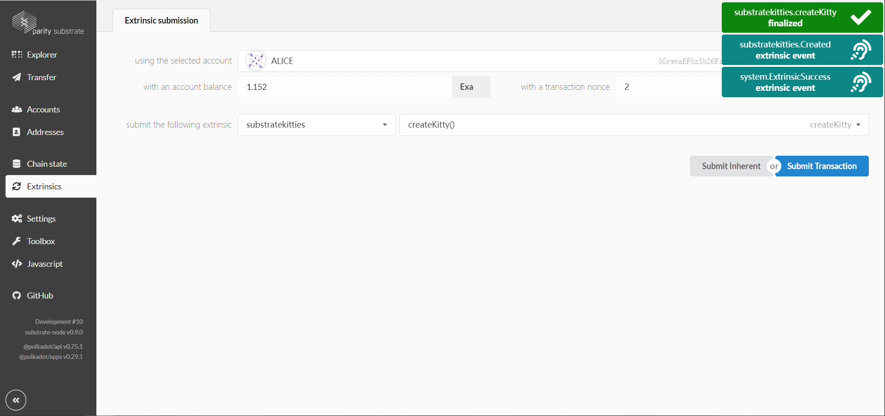

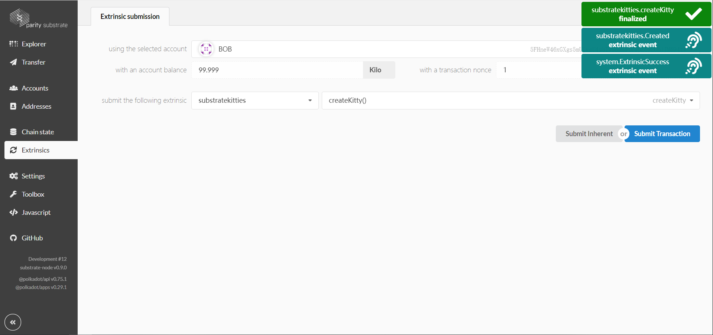

#### 查看链端数据---猫的总量

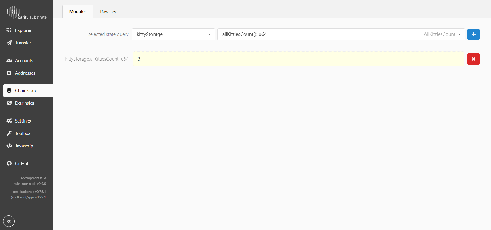

#### 买猫

> 查看Alice第一只猫的id

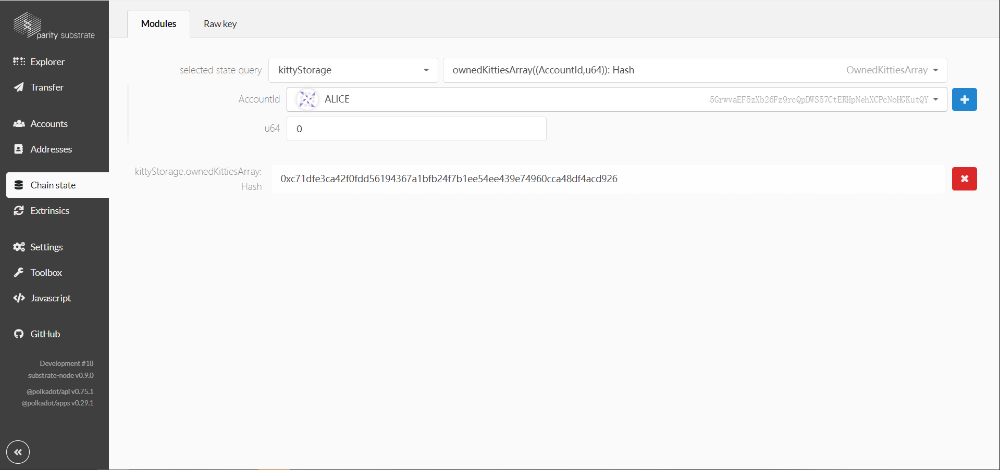

> 给Alice第一只猫定价500

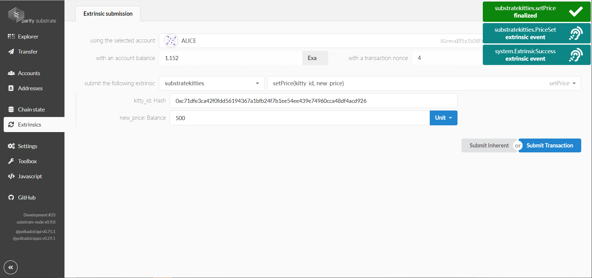

> Bob出501买Alice的猫

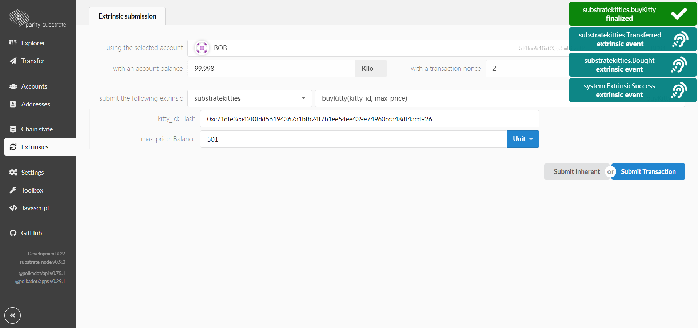

> 查看现在猫的拥有情况，可以看到Alice变成1只，Bob有2只

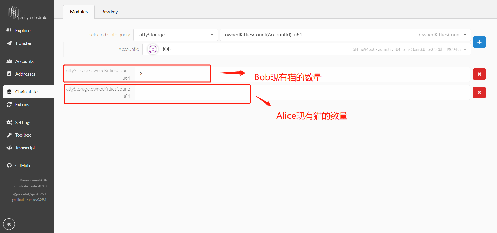

#### 生小猫

> Bob用两只猫来生小猫，先拿到两只猫的id

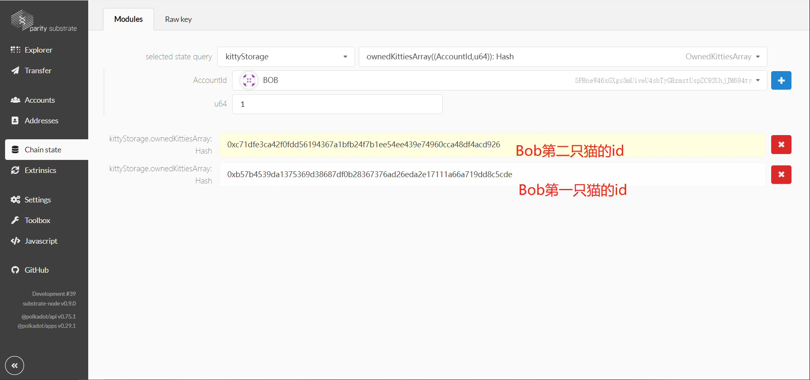

> 开始生小猫

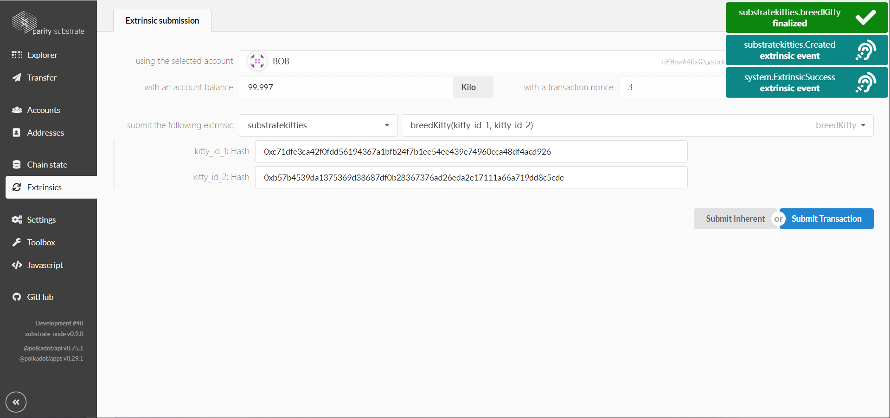

> 可以看到现在的小猫的代数已经是第一代了

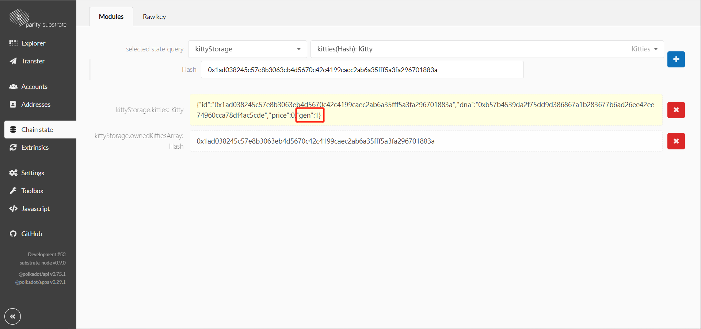

#### 转让所有权

> 将Bob的一只猫转让给Alice

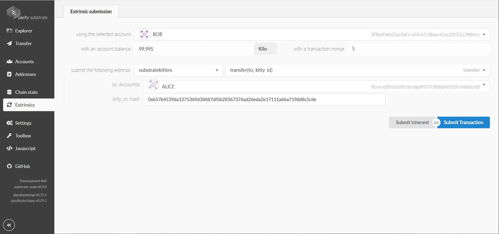

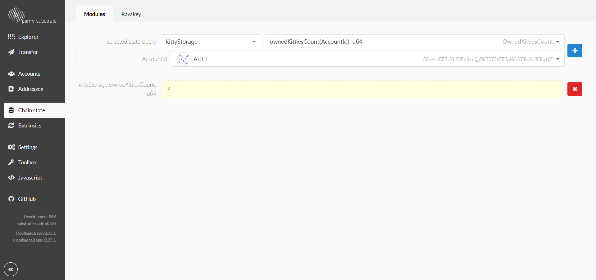

## 参考文章

- [substrate-collectables-workshop](<https://shawntabrizi.github.io/substrate-collectables-workshop/#/README>)

## 关于我们

> CrossZone社区，附属于BitHacks社区，致力于打造优秀的区块链跨链领域的生态圈。我们专注于跨链领域研究，我们团队的成员拥有多年的区块链开发经验，深根于区块链领域，从区块链底层到应用层都有所深入涉猎。我们的研究不仅关注与底层跨链架构，也关注于跨链的应用，更关注于行业整体发展方向。我们致力于打造优秀的区块链跨链社区，为区块链跨链领域的发展作出贡献，同样为区块链行业的发展作出贡献。
>
> 我们的Git:
>
> - [BitHack Technologies](<https://github.com/BithackTech>)
>
> - [CrossZone](<https://github.com/crosszonetech>)
>
> - [Sher的Git](<https://github.com/SherLzp>)
> - [ty的Git](<https://github.com/tyGavinZJU>)